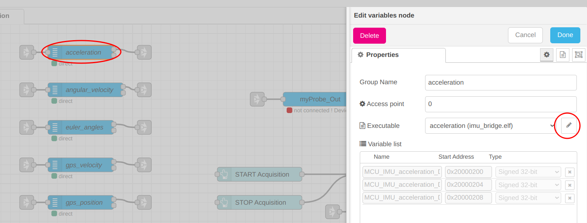
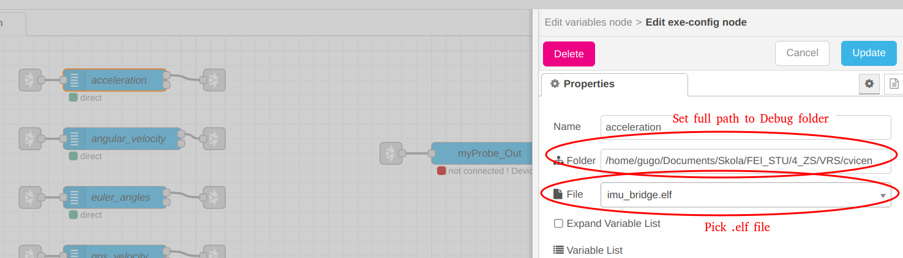

# **VRS Semestrálne zadanie: USART/CAN prevodník**

IMU (Inertial measurement unit) Xsens MTi-G-710 je združený snímač, ktorý pozostáva z akcelerometra, gyroskopu a GPS modulu. Poskytuje tak informácie o lineárnych a angulárnych zrýchleniach, orientácii a pozícii, ktoré zohrávajú kľúčovú úlohu pri určení jazdného stavu vozidla. Tieto údaje sú natívne posielané po USART zbernici cez USB rozhranie. Komunikácia medzi jednotlivými MCU v [študentskej formule SGT-FE22](https://sgteam.eu/) je zabezpečovaná prostredníctvom CAN zbernice. Hlavným cieľom tohto zadania je naprogramovať prevodník z USART na CAN zbernicu, ktorý zabezpečí odosielanie dát z IMU ostatným prvkom elektronického systému SGT-FE22.

<p align="left">
    
</p>

## **Ciele zadania**
* naprogramovať IMU Bridge MCU:
    - konverzia správ USART ➝ CAN
    - vyšetrovanie zaťaženia CAN zbernice – podiel dát prúdiacich z IMU na celkovom zaťažení CAN
* vytvoriť užívateľské prostredie prostredníctvom [STM32CubeMonitor](https://www.st.com/en/development-tools/stm32cubemonitor.html) a Node-RED<sup>®</sup> 
    - inšpekcia toku dát a zaťaženia CAN zbernice
    - konfigurácia parametrov komunikačných rozhraní CAN a USART – pre prípad napojenia zberníc s inými parametrami (napr. baud rate) 
* naprogramovať hardvérovú signalizáciu komunikácie pomocou LED diód

## **Referencie**
* [IMU Bridge schéma](./doc/IMU_Bridge_sheet.pdf)
* [MCU datasheet](./doc/stm32f105_datasheet.pdf)
* [IMU reference manual](./doc/MTi_familyreference_manual.pdf)
* [IMU user manual](./doc/MTi_usermanual.pdf)
* [IMU configuration tool manual](./doc/MT_Manager_user_manual.pdf)

----------------------------------------------------------------------------------

## **Dokumentácia**

### **XSense komunikácia**

Komunikácia s MT – Motion Tracker prebieha prostredníctvom Xbus komunikačného protokolu pomocou správ so štandardnou štruktúrou. Existujú dve dĺžky správy: *STANDARD LENGTH* a *EXTENDED LENGTH*. Najčastejšie používaná štandardná dĺžka správy obsahuje maximálne 254 dátových bajtov. Rozšírenú dĺžku správy je možné použiť v prípadoch, keď počet dátových bajtov presahuje 254.

MT správa (standard length) obsahuje tieto polia:  
```
|-----XBUS HEADER----|---------------------DATA------------------|CS|
|PREAMBLE|BID|MID|LEN|------Packet #1------|------Packet #N------|CS|
|PREAMBLE|BID|MID|LEN|DATA_ID|DATA_LEN|DATA|DATA_ID|DATA_LEN|DATA|CS|
```

MT správa (extended length) obsahuje tieto polia:  
```
|---------XBUS HEADER--------|---------------------DATA------------------|CS|
|PREAMBLE|BID|MID|LEN|LEN_ext|------Packet #1------|------Packet #N------|CS|
|PREAMBLE|BID|MID|LEN|LEN_ext|DATA_ID|DATA_LEN|DATA|DATA_ID|DATA_LEN|DATA|CS|
```

**Tabuľka: Konštrukcia Xbus správy**
| Field  |   Length   |                     Explanation                     |  |  |
|:--------:|:------------:|:-----------------------------------------------------|:--|:--|
|PREAMBLE|	1 byte    |	Indicator of start of message     -> 250 (0xFA)		|  |  |
|  BID	|	1 byte    |	Bus identifier or Address 	      -> 255 (0xFF)		|  |  |
|  MID	|	1 byte    |	Message ID. Example of possible messages with MIDs:	<br>Configuration(0x0D), WakeUp(0x3E), Reset(0x40),<br>Error(0x42), SetBaudrate(0x18) and many others.<br>!IMPORTANT! Message for measured values is named<br>MTData2 with MID 0x36	|  |  |
|  LEN	|	1 byte    |	Length of all bytes between LEN and CS.<br>For standard length message: Number of bytes in DATA<br>field. Maximum value is 254 (0xFE).<br>For extended length message: Always 255 (0xFF)	           	   |  |  |
|LEN_ext |	2 bytes   |	Exists only in ext. length massage. 16 bit number of<br>received data bytes. Maximum value is 2048 (0x0800)	|  |  |
|  DATA	| 0-2048 bytes|	Data that consists of PACKETS. Each packet contains:|  |  |
|		|			  |	DATA_ID	 | 2 bytes | Type of measured data			      |
|		|			  |	DATA_LEN | 1 bytes | Size of packet					      |
|		|			  |	DATA	 | DATA_LEN| Data packet					      |
|   CS	|	1 byte	  |	Checksum of message									      |

### **Zoznam CAN správ**
| Message ID | Message name               |
|:----------:|:---------------------------|
|    0x20    | INT_control_data           |
|    0x60    | ACU_control_status         |
|    0x70    | ACU_TSBox_data             |
|    0x90    | AMS_acuseg_voltage         |
|    0x100   | AMS_acuseq_temp            |
|    0x120   | FCU_pedal_data             |
|    0x130   | FCU_steercont_data         |
|    0x200   | DSH_shutdown_status        |
|    0x220   | ACU_AMS_command            |
|    0x225   | FCU_sensor_error           |
|    0x230   | DSH_oil_temp               |
|    0x250   | DSH_suspension_sensors_raw |
|    0x255   | INT_coolant_temp           |
|    0x256   | INT_coolant_temp_left_raw  |
|    0x257   | INT_coolant_temp_right_raw |
|    0x260   | MCU_IMU_angular_velocity   |
|    0x270   | MCU_IMU_acceleration       |
|    0x280   | MCU_IMU_euler_angles       |
|    0x300   | MCU_IMU_gps_position       |
|    0x305   | MCU_IMU_gps_speed          |


## **User manual (CubeMonitor)** ##
1. Open STM32CubeMonitor
2. Import `/project/IMU_Bridge_Inspection_flow-<SYS>-.json`
3. Update variables nodes
    <p align="left">
        
    </p>
    <p align="left">
        
    </p>
4. DEPLOY
5. Open DASHBOARD
6. Click "SET PARAMETERS" button
7. Enter USART Boud Rate value
8. Click "Write button"
9. Click "START ACQUISITION" buttons to see the data inspection
